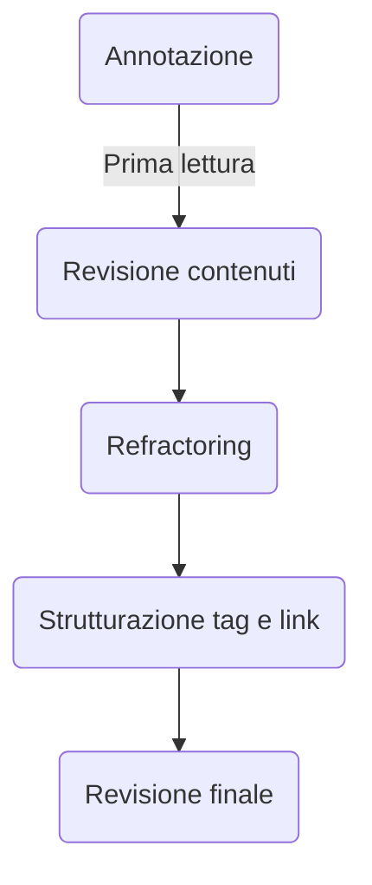

# Dashbaord
## Workflow

```mermaid
graph TD;
id1(Annotazione)
id2(Revisione contenuti)
id3(Refractoring)
id4(Strutturazione tag e link)
id5(Revisione finale)

id1 -- Prima lettura --> id2
id2 --> id3
id3 --> id4
id4 --> id5
```

## [[Life kanban]]
## Tag imporanti
- #InsiemiNumerici 
- #Insiemi 
## Links
[[Insiemi Numerici MOC]]
[[Valore assoluto]]
[[Insiemi MOC]]
[[Programmazione 1 MOC]]
