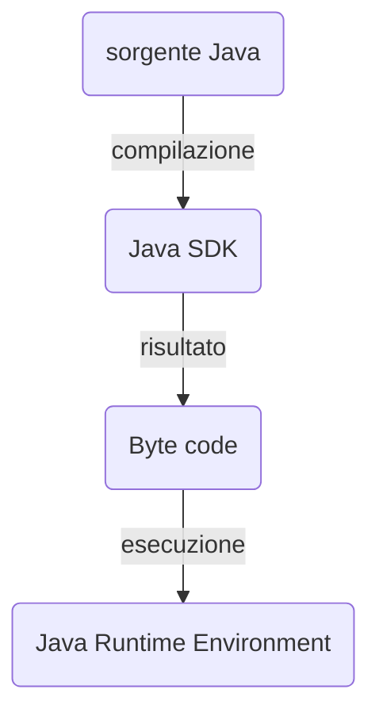

- Il compilatore produce byte code, il quale è idnipendente all'architettura della macchina (Architacture Neutral DIstrubution Format) ciò rende il codice Java runnabile su ogni dispositivo che ha installata una JVM. Da notare che il byte code non è propriamente un linguaggio a basso livello.

- La JVM essendo un ambiente di esecuzione a se stante è sicura e ad alte performance essendo ottimizazione.
- Il compilatore Java è scritto in Java stesso mentre il runtime è scritto in ANSI C il quale si interfaccia con il sistema operativo attraverso delle interfacce standard.
## Hello world
- Source code
```Java
public class main {
	public static void main(String a[]){
		System.out.println("Hello world");
	}
}
```
## Elementi lessicali
Si definiscono elementi lessicali quelle parti della sintassi di un linguaggio che vanno ad influenzare il significato di ciò che è scritto.
In Java ci sono i seguenti elementi lessicali:
- parole riservate (es. String, Class ),
- stringhe,
- numeri,
- identificatori,
## Gli identificatori
Gli identificatori sono delle sequenze di caratteri alfanumerici che servono per identificare univocamente dei componenti del codice, essi seguono queste regole:
- non possono iniziare con un numero,
- possono contenere numeri, lettere, _ e $,
- non posso usare le parole chiave del linguaggio,
- non possono contenere spazi,
- due identificatore con lo stesso scope non possono avere lo stesso nome,
- essi sono case sensitive.
### Le classi
Le classi sono molto spesso identificate con un nome scritto in PascalCase, ad esempio:
- Somma,
- MyClass,
- HelloWorld.

Se la classe ha nella sua firma la parola public, il file va salvato con lo stesso nome del file, se non ha la parola public il file può essere salvato con qualsiasi nome.
### Le variabili
Le variabili sono identificate dal loro tipo, scope e nome e posson avere n valore. Il loro identificatore solitamente identificate con un nome in in camelCase. Inoltre è sempre sconsigliato identificare una variabile con un carattere singolo ed è sempre sconsigliato far finire il nome di una variabile con il $.
Le dichiarazioni si possono fare nei seguenti modi:
```Java
//Dichiarazione singola con assegnazione
<tipo> <identificatore> = <valore>;

//Dichiarazione multipla
<tipo> <id1>, <id2>, <id3>;
```
## Le keyword
Java ha varie keyword che sono riservate e non possono essere usate come identificatori, alcune di esse sono:
- if
- else
- class
- public
## I tipi di dati
In Java esistono diversi tipi di dati, il tipo di una determinato identificatore determina cosa può contenere quella entità, ovviamente al momento dell'assegnazione, il tipo del valore da assegnare deve essere lo stesso dell'identificatore a cui si sta assegnando. Esistono due macrocategorie:
### I primitivi
|Tipo|Dimensione in memoria|
---|---|
byte|1 byte(8 bit)|
short|2 byte(16 bit)|
int|4 byte(32 bit)|
long|8 byte(64 bit)|
float|4 byte(8 bit)|
double|8 byte(64 bit)|
char|2 byte(16 bit)|
boolean|1 bit|
### Type casting
Essendo Java un linguaggio _strongly typed_, il tipo di una variabile deve essere dichiarato al momento della dichiarazione della stessa e non si possono effettuare assegnazioni tra tipi diversi, tuttavia si possono assegnare valori di tipi diversi facendo casting espliciti. Gli unici casting impliciti possibili sono questi: **byte-->short-->int-->long-->float-->double**.
Nel caso di una espressione il tipo di ritorno tra due tipi diversi è quello più a destra, ad esempio tra un _int_ e un _long_ il tipo di ritorno sarà un _long_.
#### Casting esplicito
Esempio:
```Java
double distance;
distance = 9.9;
int points;
points = (int)distance;
```
Da notare che nel caso qui mostrato il valore di points sarà 9 poiché nel casting da float a in la parte decimale viene troncata.
## Espressioni
Le espressioni sono un misto di valori e operatori che restituiscono come risultato un valore. Alcuni esempi sono:
```Java
(a+b)*c //Espressione aritmetica
a>b //Espressione logica
```
### Gli operatori
Gli sono dei simboli messi tra i valori che ritornano un risultato. Il tipo di valore dipende dalla loro cardinalità (unario, binario, ternario, ecc...). Esempi:
```Java
!a //not a, operatore unario, notazione prefissa
3+a //operatore binario
a>5 ? a-1 : a+1 //operatore ternario
```
Eistono vari tipi di operatori tra cui:
- Operatori aritmetici (per tipi interi e floating point):

Operatore|Operazione|
---|---|
+|Somma|
-|Sottrazione|
\*| Moltiplicazione|
%|Modulo|
\*\*|Elevazione a potenza|
## Stampa di stringhe
Le stringhe si possono stampare con il metodo ```System.out.println()```, nei parametri vanno passate delle stringhe che si possono concatenare con l'operatore +. Nel caso in cui si passi un valore non stringa, esso verrà "stringhizzato" per poi essere stampato.
## Commenti
```Java
//Commenti monolinea
/*
Commenti multilinea
*/
/**
Commenti documentazione
@param tipo nome
@return tipo
*/
```


